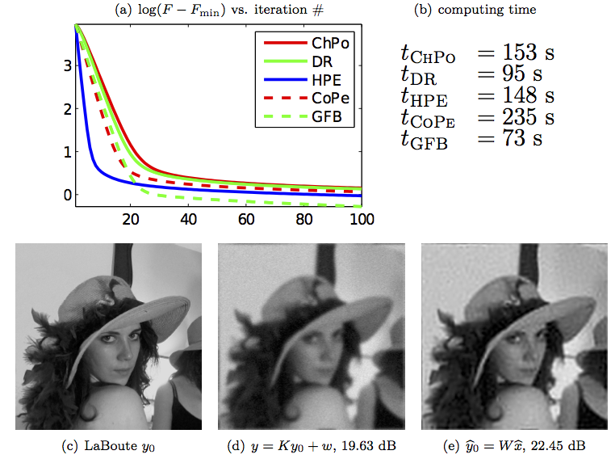

This Matlab package contains the source code to reproduce the figure of the article:

H. Raguet, J. Fadili, G. Peyré. [A Generalized Forward-Backward Splitting](https://hal.archives-ouvertes.fr/hal-00613637/). SIAM Journal on Imaging Sciences, 6(3), pp. 1199–1226, 2013.

Copyright (c) 2013 Raguet et al.
